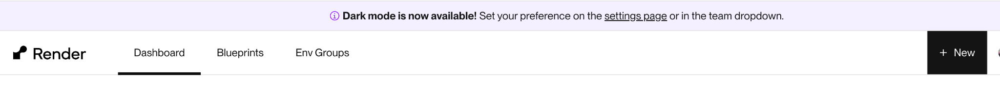
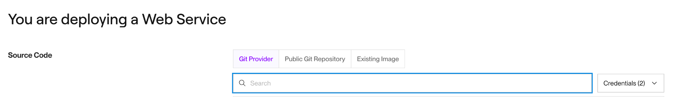
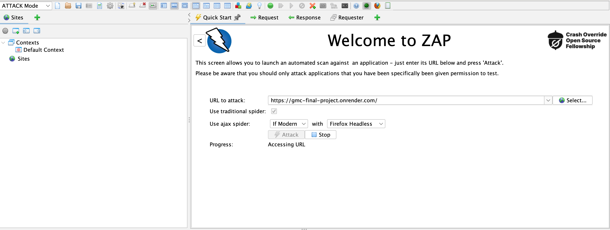
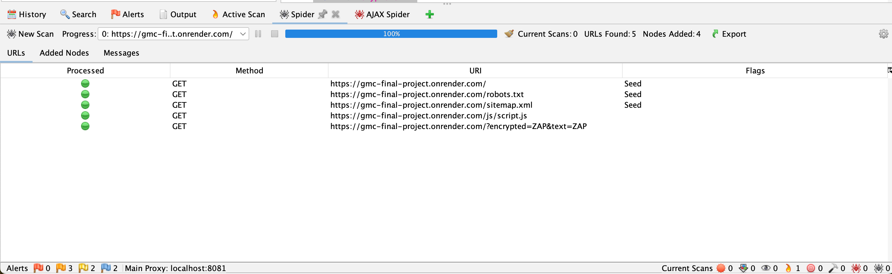
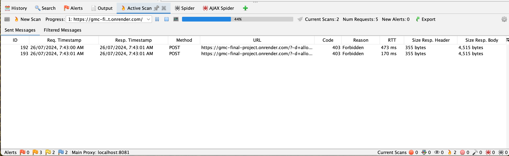
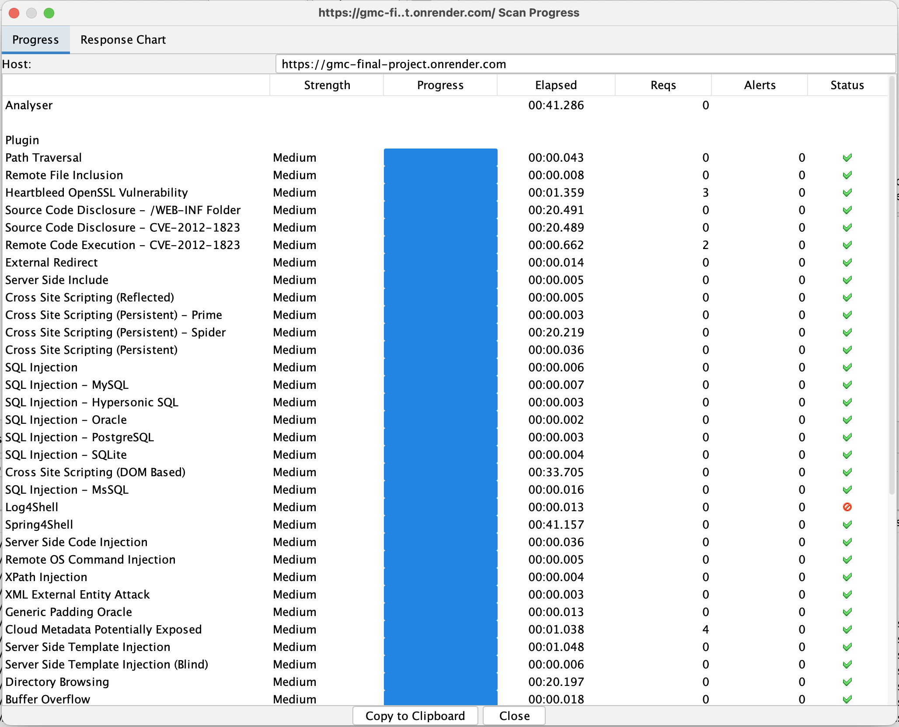
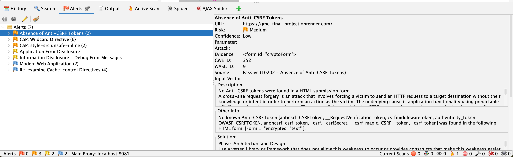

# Deploying a Web Service to Render

This guide explains how to deploy a web service to Render using a GitHub repository.

## Prerequisites

- A [GitHub](https://github.com/) account
- A [Render](https://render.com/) account
- A web service project hosted on GitHub

## Steps to Deploy

### 1. **Sign Up / Log In to Render**

Visit [Render](https://render.com/) and sign up for an account if you haven't already. Log in to your account.

### 2. **Create a New Web Service on Render**

1. Once logged in, go to the Render dashboard.
2. Click on the "+ New" button and select "Web Service" from the dropdown menu.



### 3. **Connect Your GitHub Repository**

1. Render will prompt you to connect your GitHub account if you haven't already done so. Authorize Render to access your GitHub repositories.
2. Select the repository that contains your web service project.



### 4. **Configure the Service**

1. **Name**: Enter a name for your service.
2. **Region**: Choose the region closest to your target audience.
3. **Branch**: Select the branch you want to deploy (e.g., `main`).
4. **Build Command**: Specify the command to build your application (e.g., `npm install` for Node.js projects).
5. **Start Command**: Specify the command to start your web service (e.g., `npm start` for Node.js projects).
6. **Instance Type**: Choose an instance type based on your application's needs.

### 5. **Environment Variables**

If your application requires environment variables, you can add them in the "Environment" section. For example:

- `PORT`: The port on which your web service will run (Render sets this automatically, but you can override it if necessary).

### 6. **Deploy**

After configuring the above settings, click "Create Web Service" to deploy your application.

Render will start building and deploying your application. You can monitor the deployment process in the Render dashboard. Once the deployment is complete, your web service will be accessible via the URL provided by Render.

### 7. **Monitoring and Updates**

- **Logs**: You can view logs for your service in the Render dashboard to monitor the application's status and debug issues.
- **Automatic Deploys**: Render can automatically deploy updates when you push new changes to the connected GitHub branch.

### 8. **Custom Domain (Optional)**

If you want to use a custom domain for your service, you can set it up in the Render dashboard under the "Settings" tab for your web service.

## Conclusion

You have successfully deployed your web service to Render using GitHub. For more detailed instructions and advanced configurations, refer to the [Render documentation](https://render.com/docs).

---

# Carrying out a web app security test with ZAP

After deploying the web service, it's crucial to ensure it is secure and free from vulnerabilities. The following steps outline how to use OWASP ZAP (Zed Attack Proxy) for security testing.
We would be using ZAP [Zap website](https://www.zaproxy.org)

## Setting Up OWASP ZAP

1. **Download and Install**: [Download OWASP ZAP](https://www.zaproxy.org/download/) and follow the installation instructions for your operating system.
2. **Start OWASP ZAP**: Launch the application and familiarize yourself with its interface.

## Running a Security Scan

1. **Target Application**: Set the target URL to your deployed web service's URL on Render.
Enter the url to attack then click the attack button


2. **Spidering**: Use the Spider tool to discover all the pages and endpoints of your application.


3. **Active Scan**: Perform an active scan to detect potential vulnerabilities.

On click the attack starts , you can view details about the attack below


## Understanding the ZAP Report

Here is a summary of a ZAP scan report:

- **Strength**: The severity level of the test.
- **Progress**: The progress of the test.
- **Elapsed**: The time taken to complete the test.
- **Reqs**: Number of requests made during the test.
- **Alerts**: Number of alerts triggered.

### Sample ZAP Report

```
Strength    Progress    Elapsed    Reqs    Alerts    Status
Medium      100         00:41.286  0       0         Completed
...
```


### Key Findings

- **No critical vulnerabilities were found.** The scan revealed no high-severity vulnerabilities.

- **Medium severity issues:** Several medium-severity issues were detected, such as Path Traversal, SQL Injection, and Cross-Site Scripting (XSS). Although no alerts were triggered, it is essential to review these findings and implement necessary security measures.



## Next Steps

1. **Review and Fix**: Investigate the vulnerabilities reported by ZAP and apply appropriate fixes.

2. **Re-Test**: Run another security scan to ensure that the vulnerabilities have been addressed.

3. **Continuous Monitoring**: Regularly test your application for vulnerabilities, especially after making updates or changes.


